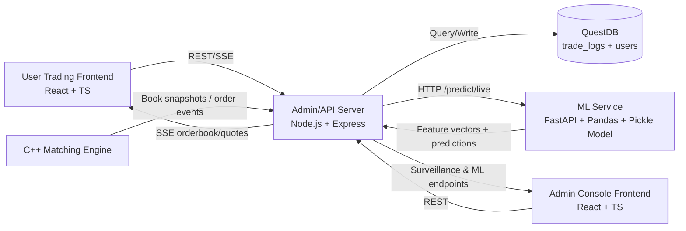
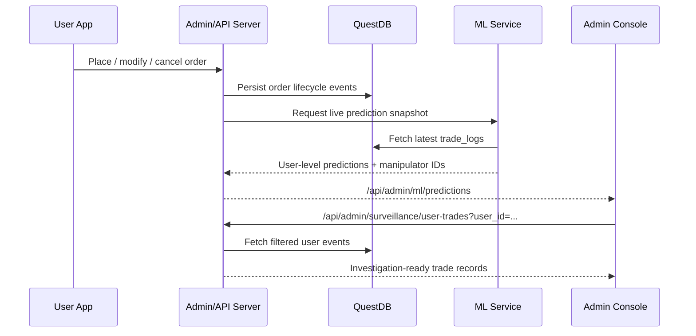
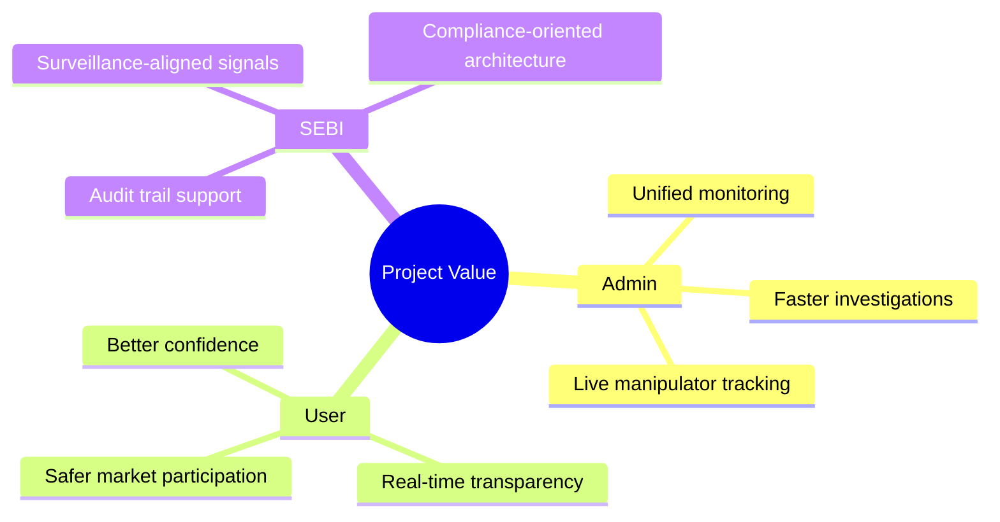

# AI-Driven Market Surveillance and Smart Trading Platform

## 1) Introduction
- Financial market abuse patterns such as spoofing and layering are difficult to detect in real time using manual surveillance alone.
- Our project integrates a trading stack (user trading interface + order handling + market data + admin surveillance) with an ML-based manipulator detection pipeline.
- The system is designed as a practical prototype for Indian-market style instruments, with continuous monitoring and investigation support.
- The key idea is to bridge **execution data** and **regulatory-style surveillance intelligence** in one deployable platform.

## 2) Problem Statement
- Existing paper-trading/retail dashboards usually focus on order placement and P&L, but do not provide strong manipulative behavior detection and forensic traceability.
- Surveillance tools and trading tools are often disconnected, delaying investigation and increasing response time.
- Regulators and platform admins need evidence-rich, near-real-time signals, not only static reports.

## 3) Objectives
- Build an end-to-end full-stack trading and surveillance platform with real-time market data and order lifecycle tracking.
- Detect potentially manipulative users using engineered behavioral features and ML inference over live trade logs.
- Provide admin-side actionable views: tracked manipulator users, user-level trade drill-down, and live model health.
- Demonstrate measurable, reproducible quantitative outputs from project artifacts.

## 4) Dataset and Data Sources (Project-Verified)
- **Large behavioral datasets used in model pipeline**
  - `model/layering.csv`: **240,343 rows**, 25 columns
  - `model/spoofing.csv`: **236,473 rows**, 25 columns
- **Evaluation/output artifact**
  - `model/combined.csv`: **125 rows**, 26 columns (contains both `trader_type` and `predicted_trader_type`)
- **Live runtime source**
  - QuestDB `trade_logs` table (queried by Admin API and ML service)
- **System instruments**
  - 15 Indian-market symbols (stocks + indices) integrated in platform flow.

## 5) Methodology
### 5.1 Pipeline Overview
1. Collect order/trade lifecycle records from `trade_logs`.
2. Engineer per-user behavior features (cancel rate, fill ratio, latency, imbalance, quote-to-trade, price deviation, etc.).
3. Apply trained model inference.
4. Apply rule-based anomaly overlays (extreme quantity, rapid cancel, price-quantity anomaly).
5. Publish manipulator candidates to admin surveillance endpoints/UI.

### 5.2 Feature Engineering Highlights
- Cancel behavior: `cancel_rate`, `cancel_to_order_ratio`, `zero_fill_cancel_rate`, `avg_time_to_cancel`.
- Execution and latency: `avg_engine_latency`, `max_engine_latency`, `fill_ratio`.
- Market behavior: `order_book_imbalance`, `avg_price_deviation`, `unique_instruments`, `unique_sides`.
- Interaction features: `latency_cancel_interaction`, `fill_cancel_interaction`.

### 5.3 Model + Rules Fusion
- Final prediction is max(model_prediction, rule_based_flag), improving detection of rare abnormal patterns that may be missed in pure model classification.

## 6) System Architecture Diagram (Mermaid)

## 7) Data Flow Diagram (Mermaid)

## 8) Quantitative Analysis (Authentic, from Project Files)
### 8.1 Verified Evaluation on `model/combined.csv`
- Total evaluated rows: **125**
- Confusion matrix values:
  - **TP = 2, TN = 120, FP = 1, FN = 2**
- Derived metrics:
  - **Accuracy = 97.60%**
  - **Precision = 66.67%**
  - **Recall = 50.00%**
  - **F1-score = 57.14%**
- Class imbalance:
  - Actual manipulator rate: **3.2%** (4/125)
  - Predicted manipulator count: **3**

### 8.2 Latency/Behavior Stats from Same Artifact
- Median `avg_engine_latency`: **1.8e-08**
- Maximum `max_engine_latency`: **0.089369422**

### 8.3 Data Quality Observation (Important for Credibility)
- In `combined.csv`, all rows show negative `avg_time_to_cancel` values, indicating timestamp consistency issues in this artifact.
- Therefore, the above metrics are authentic to repository output but should be presented as **prototype evaluation on current artifact**, not final production-grade benchmark.

## 9) Qualitative Analysis (Authentic, Code/Flow-Based)
- **End-to-end integration achieved**: user trading, admin analytics, surveillance, and ML inference are operationally connected through implemented APIs.
- **Real-time posture**: system uses streaming/periodic refresh flow for quotes, order book, and manipulator tracking.
- **Investigation readiness**: admin can move from manipulator ID list to user-level trade logs quickly.
- **Operational resilience pattern**: API supports direct/fallback order-book paths and health-check endpoints for service observability.
- **Practical limitation identified**: metrics shown on UI currently include heuristic placeholders in one component and should be aligned to true confusion-matrix computation for formal reporting.

## 10) Uniqueness / Value Proposition
### 10.1 From Admin POV
- Unified command center combining market, order, trade, and ML surveillance workflows.
- Dynamic manipulator tracking with drill-down to transaction-level evidence.
- Faster incident triage via one platform instead of fragmented tools.

### 10.2 From User POV
- Real-time market depth and order lifecycle visibility.
- More trustworthy trading environment due to active anti-manipulation surveillance.
- Better transparency when abnormal participants are monitored and flagged.

### 10.3 From SEBI POV (Regulatory Perspective)
- Supports surveillance intent with behavior-driven alerts and user-level audit trails.
- Provides a replicable architecture for near-real-time monitoring of suspicious market conduct.
- Enables data-backed compliance workflows (traceability from detection signal to underlying order events).

## 11) Innovation Highlights
- Hybrid detection (ML + deterministic rules) for rare-event robustness.
- Tight coupling between execution infrastructure and surveillance intelligence.
- Stakeholder-balanced design: trader usability + admin control + regulator alignment.

## 12) Conclusion
- The project demonstrates a functioning prototype of AI-assisted market surveillance integrated with a live trading stack.
- Quantitative outputs show high overall accuracy but moderate precision/recall under class imbalance, reinforcing the need for further dataset balancing and calibration.
- The system is a strong base for event-scale demonstration because architecture, workflows, and evidence paths are concrete and reproducible.

## 13) Future Scope
- Build a formally validated benchmark set with timestamp-cleaned ground truth labels.
- Introduce model calibration, threshold optimization, and PR-AUC tracking for imbalanced detection.
- Add explainability panels (feature contribution per flagged user) for compliance confidence.
- Integrate alert severity scoring and case-management workflow for surveillance teams.
- Conduct latency/load tests and harden for production-grade deployment.

## 14) Recommended Poster Diagram Set (Mermaid Ready)
### A) System Architecture (already given above)
### B) Data Flow Sequence (already given above)
### C) Stakeholder Value Map

## 15) References (Use in Poster)
- Internal project repository modules:
  - `backend/admin-api/server.js`
  - `model/app.py`
  - `model/predictor_service.py`
  - `frontend_admin/sentinel-console-main/src/pages/admin/MLModel.tsx`
  - `frontend_admin/sentinel-console-main/src/pages/admin/Surveillance.tsx`
- Data artifacts:
  - `model/layering.csv`
  - `model/spoofing.csv`
  - `model/combined.csv`

---

## 16) One-Line Poster Tagline
**"Real-time trading + AI surveillance in one integrated platform for proactive market integrity."**
